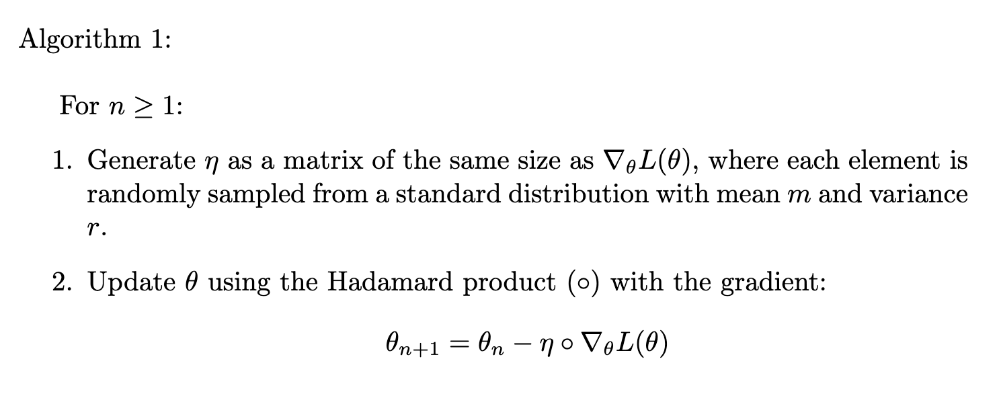

## Abstract
우리가 원하는 인공신경망을 만들어내기 위해 딥러닝은 현재 다양한 분야에서 그 효과를 입증하며 유용하게 사용되고 있다. 딥러닝에서, 어떻게 우리가 원하는 신경망을 만들어 낼 수 있는가 는 계속해서 연구되고 있는 분야다. input에 대해 parameter로 곱연산과 합연산을 하고, 이후 비선형 활성화함수를 통해 임의의 함수에 근사시킬 수 있다. 그러나 근사 해가 존재하는 것과 근사 해를 찾는 것은 다른 문제다(물론 존재성이 선행되어야 한다.). 본 글에서는 FNN의 Loss landscape에서 기존의 optimizer 기법이 어떻게 보다 나은 해를 찾아가는지 살펴보고, 기존에 통념적으로 사용하는 기법에 대해 그것이 최적이 맞는가 에 대한 질문을 던진다. 미적분학에서 함수 $f(x)$에 대해 가장 변화율이 큰 방향은 $\nabla f(x)$이다. 때문에 Gradient method들은 $\theta_{n+1} = \theta_n - η \cdot \nabla_\theta L(\theta)$를 반복하는 것으로 parameter를 원하는 최적값에 수렴시키려 한다. 그런데 이것이 정말 최적일까?

## Notation and Intro
$\rho := \text {active function, some non-linear function}$,
$\gamma := \text {output function}$,
$W_k := \text {Weight},(d_{k+1} \times d_k) matrix$,
$B_k := \text {Bias},(d_{k+1} \times 1) matrix$,
$L_0 := intput, (d_0 \times 1) matrix$,
$L(x, T) = \text{Loss function, x is output, T is target}$

$L_1 = W_0 \cdot (L_0) + B_0$
$L_{k+1} = W_k \cdot \rho(L_k) + B_k \text{    }(k \geq 1)$
$F(x;\theta) = \gamma(W_n \cdot \rho(L_{n-1}) + B_n)$

여기서 우리의 목적은 
$\arg\min_\theta L(F(x;\theta), t_x)$ 를 찾는 것이다.

간단하게, $L(F(x;\theta), t_x) = L(\theta)$ 로 표시하자.
$L(\theta)$의 Local minimum을 찾는 알고리즘

$\theta_{n+1} = \theta_n - η \cdot \nabla_\theta L(\theta)$ 를 반복할 때, 특정한 $L$의 조건 하에서(ex. Convex, L-smooth etc.)

$\theta_n \to \theta^\*$ 가 되는 것이 알려져 있다. 
($L(\theta^\*)$는 $L$의 Local minimum))

그런데 우리가 실제로 학습을 시킬 때에, Loss가 전체 domain에서 convex한건 아주 특별한 상황이다. 거의 모든 경우에 non-convex optimize ploblem을 해결해야 한다.

non-convex optimize ploblem을 해결하기 위해 opimizer들은 두 가지 목적으로 발전해왔다.
1) Escape Local minimum 
2) Fast converge

어떻게 Local minimum을 탈출하며 Global minimum을 빠르게 찾아갈 수 있을까?
이를 위해 Gradient Descent는 Mini-batch를 도입해 Stochastic Gradient Descent를 사용한다. 한번에 전체 dataset에 대해 학습시키는게 아니라, dataset의 일부를 추출해 학습을 수행하고, 그 다음에 또 다른 일부를 추출해 학습시키는걸 반복하는 것이다. 학습에 이런 확률을 도입하는 것으로, 보다 적은 연산으로 optim을 향해가면서, Local minimum을 피하는 것이다. 그리고 이런 SGD를 기반으로, 각 parameter에 대해 다른 학습률을 적용하거나, 학습 속도를 자체적으로 조절하는 여러가지 method들이 개발되어왔다.

그럼 이제 다음 질문을 던져보자. 학습에 다른 확률적 요소를 부여할 수는 없을까? 

## Stochastic Drift Gradient

Minimatch sampling을 통한 확률적 요소 외에 다른 확률 요소를 추가하면 어떻게 될까. 이를 위해 다음과 같이 알고리즘을 구성하자.

실험적으로 충분히 작은 분산에 대해, 이 알고리즘은 Local minimum에 수렴한다.
그런데 확률적 요소가 부여되었으므로, 이는 실험적으론 수렴하는 듯 보이면서도 가중치의 갱신 방향이 항상 minimum의 방향이 아니므로 Local minimum을 탈출할 확률을 갖는다.
그럼 어떤 확률로 Local minimum을 탈출하고 어떤 확률로 minimum에 다가갈까.

Theorem 1:
다음 조건 
1)
2)
3)
... 에서,
Algorithm 1은 $s$의 확률로 Local minimum에 수렴한다.

먼저 Theorem 1을 완성하자. 어떤 조건 하에서 수렴하는지 보일 수 있다면 어떤 조건에서 local minimum을 탈출하는지도 보일 수 있을 것이다.
